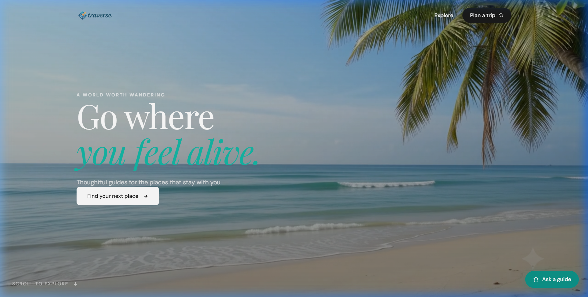
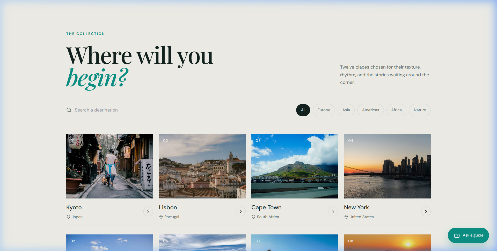
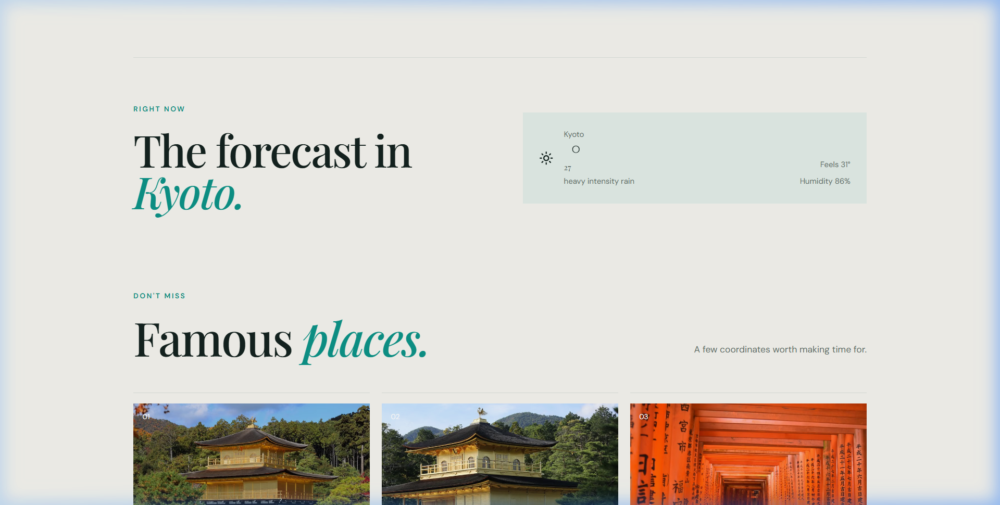
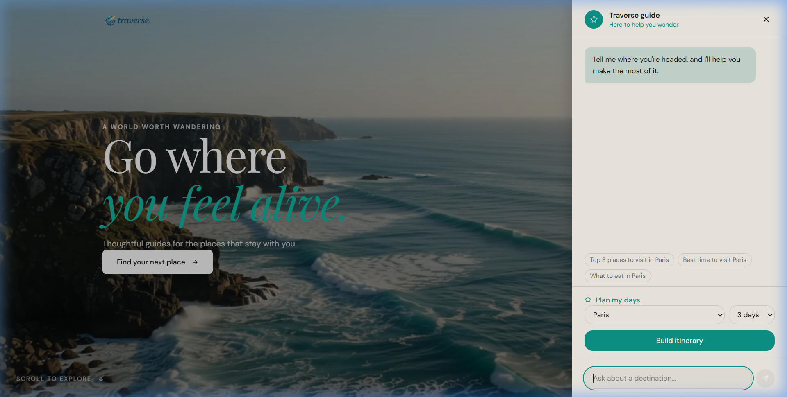
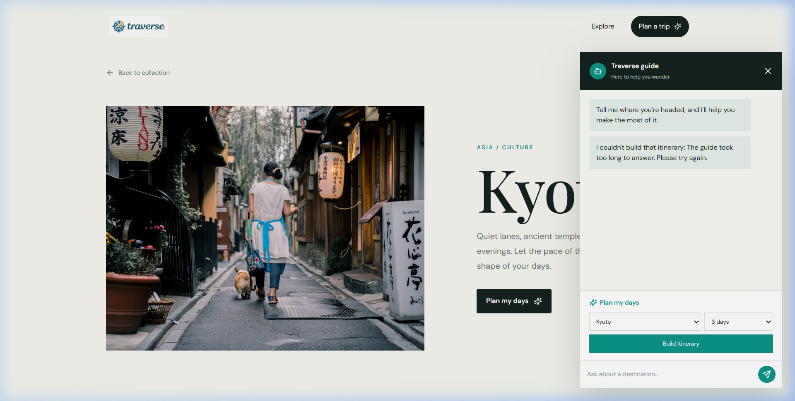
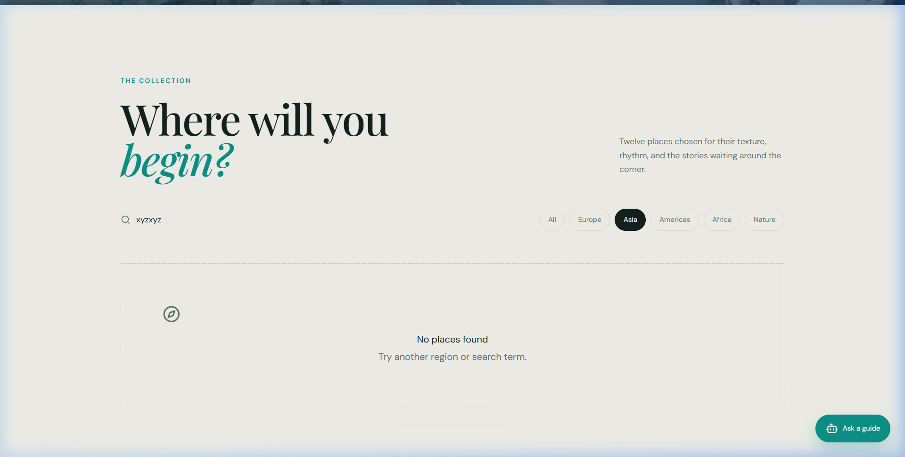

# Traverse — Thoughtful Travel & AI Guide

A front-end travel web application built with **React (Vite)** and **Tailwind CSS**. Traverse provides an editorial, magazine-style travel discovery experience, combining curated destinations, live photography, real-time weather forecasts, browser geolocation, and an AI-powered travel assistant with day-by-day itinerary planning.

---

## 1. Overview

Traverse was built as a modern, static front-end travel companion. The project operates with **zero backend and no database** — all data fetching and intelligence happens directly from the client using third-party APIs secured via Vite environment variables (`import.meta.env`).

### What We Built
- **An Editorial Travel Discovery Platform**: Inspired by minimalist editorial design, featuring warm cream backgrounds, elegant serif typography (*Playfair Display*), clean sans body text (*DM Sans*), and deep teal accents.
- **Dynamic Third-Party Integrations**:
  - **Pexels API** for search-driven, live travel and landmark photography.
  - **OpenWeatherMap API** for real-time local conditions and city forecasts.
  - **Google Gemini API (`gemini-3.6-flash`)** for contextual travel Q&A and strict JSON day-by-day itinerary generation with multi-model failover.
  - **HTML5 Geolocation API** for automatic location detection with a graceful manual search fallback.
- **Client-Side Architecture**: Lightweight routing with `react-router-dom` and animations with `framer-motion`, strictly avoiding bulky state libraries or heavy UI frameworks.

---

## 2. Screenshots of the Application

### Landing Page & Video Hero
Full-screen hero with looping background video, bold typography, and an animated scroll cue leading into the collection.



---

### The Collection (Destination Explorer)
Responsive 4-column destination grid with numbered badges (`01`, `02`, ...), live search bar, and regional filter chips.



---

### Destination Detail Page
Split-screen editorial view featuring high-resolution photography, cultural highlights, and a quick-action "Plan my days" trigger.


---

### Real-Time Weather & Live Forecast
Sage-toned current weather widget showing temperature, feels-like conditions, humidity, and weather description.



---

### Traverse AI Guide (Slide-out Drawer)
Floating "Ask a guide" trigger expanding into a slide-out assistant panel powered directly by Google's Gemini API.



---

### Day-by-Day Itinerary Planner
Interactive trip generator parsing structured JSON into a visual, day-by-day timeline with themed activities.



---

### Unhappy Path & Empty States
Considered empty states featuring dashed containers, custom icons, and helpful hints when filters or searches match no places.



---

## 3. Features Completed

### 🎥 Landing Page & Video Hero
- Full-viewport hero section with auto-looping, muted background video (`/public/hero.mp4`).
- Playfair Display headline with stylized italic teal accent words.
- Smooth scroll cue linking directly to the collection grid.

### 🧭 Destination Explorer
- 15 curated global destinations across Europe, Asia, the Americas, and Africa (including Kyoto, Paris, Jaipur, Goa, Varanasi, Cape Town, and more).
- Borderless cards with numbered badges, location indicators, and hover lift transitions.
- Real-time search by destination name, country, or tag.
- Interactive filter chips (`All`, `Europe`, `Asia`, `Americas`, `Africa`, `Nature`).
- Shimmer skeleton loading cards matching exact card dimensions.

### 📍 Destination Detail View
- Dedicated route per destination (`/destination/:id`).
- Side-by-side split layout: high-resolution photography on the left, editorial story on the right.
- "Right now" current weather forecast section.
- "Famous places" section rendering landmarks as structured cards with numbered badges and descriptions.
- "Plan my days" button that opens the AI assistant with that destination pre-selected.

### ⛅ Real-Time Weather Integration
- Client-side fetch to OpenWeatherMap API using latitude and longitude coordinates.
- Weather data display: temperature in Celsius, feels-like metric, humidity percentage, and sky description with official weather icon.
- Full states designed: loading state, error alert with retry button, and compact / card displays.

### 🌍 Location Awareness & Fallbacks
- Prompts visitor for browser geolocation on initial load.
- If granted, displays live weather for the visitor's current location.
- If denied or unsupported, gracefully renders a fallback UI with an inline city search form.

### 📸 Dynamic Photography (Pexels API)
- No hardcoded image URLs — images are queried live from the Pexels REST API.
- Fallback SVG placeholders ensuring broken image icons never appear.
- Smooth opacity fade-in transition once images are loaded.

### 🤖 AI Travel Chatbot (Gemini API)
- Floating "Ask a guide" button anchored in the bottom-right corner.
- Slide-out drawer with backdrop blur, message history, and quick-prompt suggestions.
- Direct client-side calls to Gemini models (`gemini-3.6-flash`).
- **Multi-Model Failover**: Automatically retries across backup models (`gemini-flash-latest-high-res-exp`, `gemini-3.8-flash`) if Google servers experience 503 high-demand spikes.

### 📅 Itinerary Planner
- Dedicated itinerary form with destination picker, day duration selector (1 to 14 days), and "Build itinerary" button.
- Natural language intent extraction for chat queries like *"Plan me a 4-day trip to India"*.
- Prompts Gemini for strict JSON responses, parses the output, and renders a structured day-by-day timeline.
- Graceful curated fallback generator ensures visitors always receive a day-by-day itinerary even during external network outages.

### ✨ Design Polish & Accessibility
- Cohesive editorial design system with CSS custom properties.
- Subtle Framer Motion micro-animations: staggered card reveals, drawer slide-ins, and button interactions.
- Semantic HTML tags (`<nav>`, `<main>`, `<section>`, `<footer role="...">`).
- Accessible `:focus-visible` outlines, screen-reader `.sr-only` labels, and descriptive `alt` tags on all images.
- Fully responsive from mobile devices (320px) to wide desktop screens.

---

## 4. Instructions on How to Run the Project

Follow these steps to set up and run Traverse on your local machine:

### Prerequisites
Make sure you have the following installed:
- [Node.js](https://nodejs.org/) (version 18.0 or higher recommended)
- [npm](https://www.npmjs.com/) (bundled with Node.js) or `yarn`

---

### Step 1: Clone the Repository
```bash
git clone https://github.com/Suraj-Airani/Traverse.git
cd Traverse
```

---

### Step 2: Install Dependencies
Install the required packages (`react-router-dom`, `framer-motion`, `@tailwindcss/vite`, etc.):
```bash
npm install
```

---

### Step 3: Configure Environment Variables
Create a `.env` file in the root directory:
```bash
# Windows PowerShell
New-Item -ItemType File -Name ".env"
```

Add your API keys to `.env`:
```env
VITE_OPENWEATHER_KEY=your_openweathermap_api_key
VITE_PEXELS_KEY=your_pexels_api_key
VITE_GEMINI_KEY=your_gemini_api_key
```

> **Where to get API keys:**
> - **OpenWeather API Key**: Sign up at [openweathermap.org](https://openweathermap.org/api) (Free Tier).
> - **Pexels API Key**: Sign up at [pexels.com/api](https://www.pexels.com/api/) (Instant free key).
> - **Gemini API Key**: Generate at [aistudio.google.com](https://aistudio.google.com/) (Google AI Studio).

---

### Step 4: Run the Development Server
Start Vite's local dev server:
```bash
npm run dev
```

Open your browser and navigate to:
```text
http://localhost:5173
```

---

### Step 5: Build for Production
To build the application for production deployment:
```bash
npm run build
```

To preview the production build locally:
```bash
npm run preview
```

---

## Tech Stack Summary

| Layer | Technology |
|---|---|
| **Core** | React 19, JavaScript (ES6+), HTML5, CSS3 |
| **Build Tool** | Vite 8 |
| **Styling** | Tailwind CSS v4 + Custom Design Tokens |
| **Routing** | React Router DOM v7 |
| **Motion** | Framer Motion |
| **Weather API** | OpenWeatherMap Current Weather REST API |
| **Images API** | Pexels REST API |
| **AI / LLM** | Google Gemini Generative Language API |

---

## Folder Structure

```text
Traverse/
├── screenshots/               # Application preview screenshots
│   ├── 01-hero-landing.png
│   ├── 02-destination-collection.png
│   ├── 03-destination-detail.png
│   ├── 04-weather-forecast.png
│   ├── 05-ai-guide-drawer.png
│   ├── 06-itinerary-planner.png
│   └── 07-empty-search-state.png
├── public/                    # Static public assets
│   ├── favicon.png            # App favicon
│   ├── hero.mp4               # Looping hero background video
│   └── logo.png               # Brand logo
├── src/
│   ├── components/            # UI components
│   │   ├── ChatBot.jsx        # Slide-out AI travel guide drawer
│   │   ├── DestinationCard.jsx # Numbered destination card
│   │   ├── DestinationPage.jsx # Destination detail page
│   │   ├── EmptyState.jsx     # Search & filter empty state
│   │   ├── ErrorState.jsx     # Error alert with retry button
│   │   ├── ExplorePage.jsx    # Collection explorer route
│   │   ├── FamousPlaceCard.jsx # Landmark cards with live images
│   │   ├── FilterChips.jsx    # Region & category filter pills
│   │   ├── Hero.jsx           # Full-screen video hero
│   │   ├── ItineraryTimeline.jsx # Day-by-day visual timeline
│   │   ├── LandingPage.jsx    # Landing page with collection & weather
│   │   ├── LocationFallback.jsx # Manual location search fallback
│   │   ├── Navbar.jsx         # Minimal header with guide trigger
│   │   ├── ScrollReveal.jsx   # Framer Motion scroll wrapper
│   │   ├── SearchBar.jsx      # Search input with live filter
│   │   ├── SkeletonCard.jsx   # Shimmer loading placeholders
│   │   └── WeatherWidget.jsx  # Real-time weather widget
│   ├── data/
│   │   └── destinations.js    # Curated travel destinations dataset
│   ├── lib/
│   │   └── api.js             # API helper functions (Weather, Pexels, Gemini)
│   ├── App.jsx                # App shell, routing & geolocation state
│   ├── index.css              # Typography, design tokens & base styling
│   └── main.jsx               # Entry point with BrowserRouter
├── .env                       # API keys (git-ignored)
├── .gitignore                 # Git ignore rules
├── index.html                 # HTML template with SEO tags
├── package.json               # Dependencies and scripts
└── vite.config.js             # Vite configuration
```

---

## License

This project is open source and available under the [MIT License](LICENSE).
